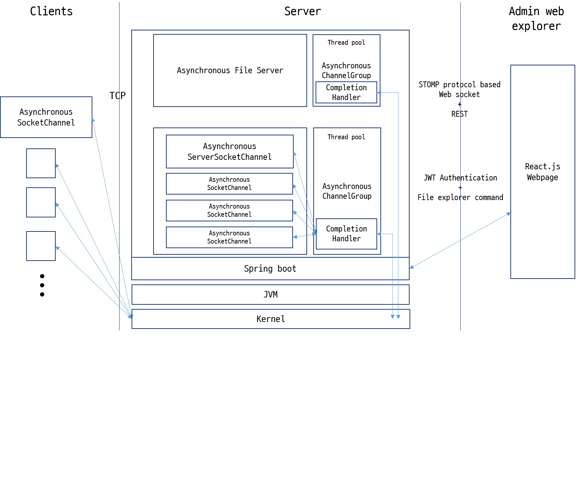
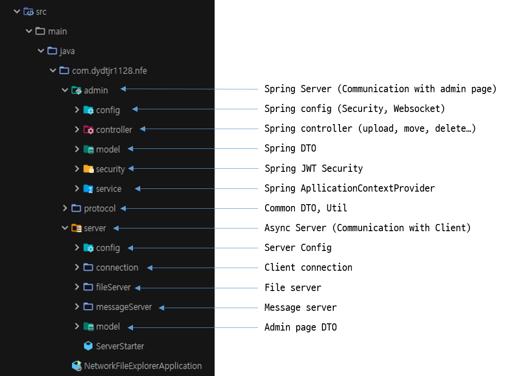

## Welcome to NetworkFileExplorer(네트워크 파일 탐색기) project!

### What Is It?

The NetworkFileExplorer is a cross platform web explorer project that allows you to view a client's directory on the Admin page, just like the File Explorer in Windows.

This project was implemented based on Java asynchronous non-blocking socket channel(`AsynchronousSocketChannel`, `AsynchronousServerSocketChannel`). 

`AsynchronousSocketChannel` and `AsynchronousServerSocketChannel` work as an `IOCP` in a Windows and as an `epoll` in a Linux.

네트워크 파일 탐색기는 크로스 플랫폼을 지원하는 윈도우에 있는 파일탐색기느낌의 웹 탐색기 프로젝트입니다.
비동기 `AsynchronousSocketChannel`을 사용하여 클라이언트들의 드라이브를 어드민 페이지에서 탐색 할 수 있습니다.

#### Demo screenshot


The Admin page provides several functions.

- Show file & directory (include name, last-modified date, type, file size)
- Provides a file & directory deletion.
- Provides a file upload/download
- Provides a file move
- Provides a file copy
- Provides a file name change
- Show client connection in real time.
- Support Windows/Linux OS
- Support Docker images to easy build&run

## Docker build & run

You can build and execute using the commands below.

### Server build

```bash
cd .\Server
mvn clean package
docker build -t network-file-explorer-server:dev .
```

### Server run

```bash
docker run -v ${PWD}:/app -p 8080:8080 --rm -it network-file-explorer-server:dev
```

### Front build

```bash
cd .\Front\
docker build -t network-file-explorer-front:dev .
```

### Front run

```bash
docker run -v ${PWD}:/app -v /app/node_modules -p 3000:3000 --rm -it network-file-explorer-front:dev
```

### Client run

I do not recommend using client as a docker. because client application access all drive.

You can easy to start with .jar file.

## Structure



The server acts as a broker between the admin page and the client. 
Data communication between the client and the server uses the protocols below. Also, messages between sending and receiving data are compressed using the `Snappy` library.

## Message Protocol


This protocol is used to send with receive server and clients

## Server package structure



## Class Diagram

### Server


### Client


## Sequence diagram

### Server


### Client


## TODO

- [ ] Improve file upload/download.
- [ ] File access permission to admin.
- [ ] Support file action(change, move, rename ...) transaction.
- [ ] Update spring rest function/url more explicitly.
- [ ] need effective locking about simultaneous access.
- [ ] React rendering time out.
- [ ] Event driven based asynchronous UI event about action when success/fail.
- [x] Packaging to docker.
- [x] Support CI(Github action) with master branch push hook.


## Contributing
1. Fork it (https://github.com/dydtjr1128/NetworkFileExplorer/)
2. Create your feature branch (git checkout -b feature/issueName)
3. Commit your changes (git commit -am 'Add some fooBar')
4. Push to the branch (git push origin feature/issueName)
5. Create a new Pull Request

<br/> 

<a href="mailto:dydtjr1128@gmail.com" target="_blank">
  
</a>
<a href="https://dydtjr1128.github.io/" target="_blank">
  
</a>
